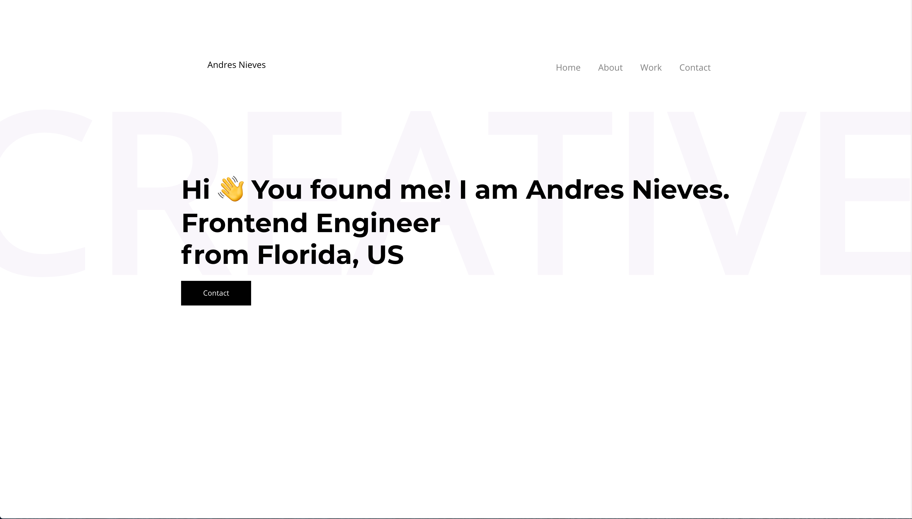

# React Portfolio Template

Minimal Portfolio template for Developers/Designers built with React. Use it to showcase your work, testimonials and other information to clients.

## The Data can be customised in the src/yourdata.js

That's it!

## Features

- Production Ready
- Fully Responsive
- Easy To Customize and Personalise
- Amazing Animations
- Minimal & Modern Design

## How to use

1.Clone/Download the repo.
2.Run npm install or yarn install.
3.Change the values in src/yourdata.js to suit your use-case.
4.Run npm start or yarn start to start the local dev server port 3000.(http://localhost:3000).

# Full Preview -

## Created by Andres Nieves

License
(MIT)!
